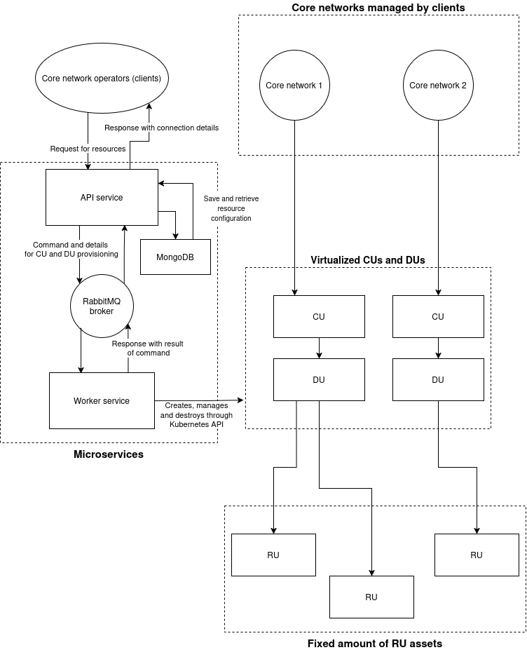

# Service architecture for RANaaS service using srsRAN and Kubernetes

The proposed architecture consists of an API microservice that receives resource requests from core network operators, and forwards them to a worker microservice that provisions the required resources (virtualized CU and DU), and connects the DU to a number of RUs.

After finishing its work, the worker service reports back to the API service, which sends a reponse containing connection details in order to connect the core network to the provisioned CU.

The CUs and DUs are fully virtualized and run in Kubernetes pods. The RUs are also virtual (implemented with srsRAN ru_emulator) and run in Kubernetes.

The full architecture is depicted in diagram below.

## Implementation details

The API microservice could be implemented as a web API using FastAPI. For the worker microservice, there is also a Python library available, that makes it possible to interact with Kubernetes API: [Kubernetes Python Client](https://github.com/kubernetes-client/python). For communication between the microservices through RabbitMQ, [Pika](https://pypi.org/project/pika/) could be used.
