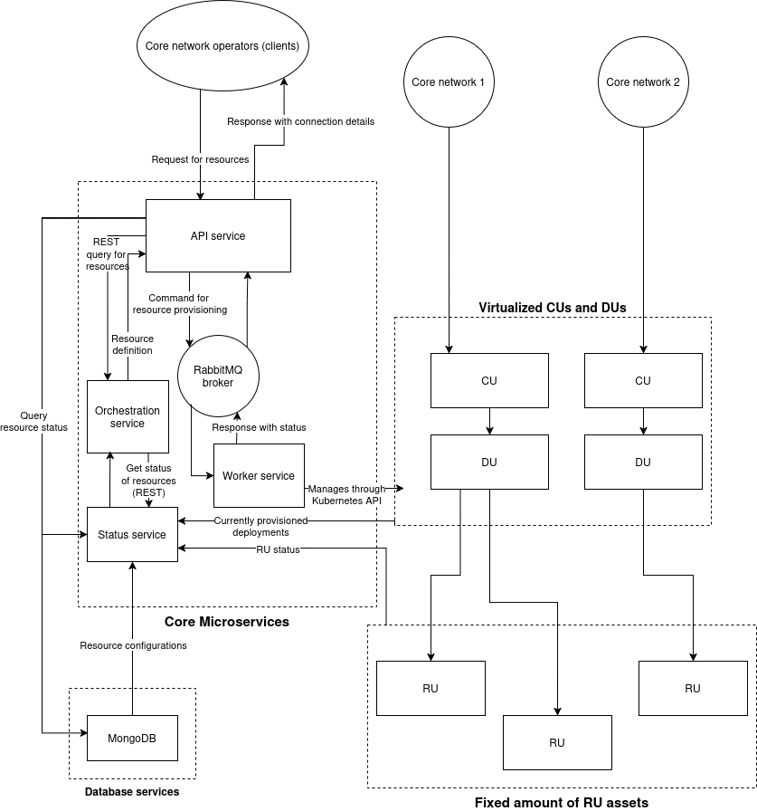

# Service architecture for RANaaS implementation using srsRAN and Kubernetes

The full architecture is depicted in diagram below.

### Architecture overview

The architecture consists of an API microservice that receives resource requests from core network operators, which are forwarded to orchestrator service that gets the current state of the system, which includes current deployments and database entries, and makes a decision on which resources can be provisioned. After this, it creates a resource definion and returns it back to the API service. The API service sends the resource definition to a worker microservice that provisions the required resources (virtualized CU and DU), and connects the DU to a number of RUs. 

As also visible in the architecture diagram, the number of worker nodes can be scaled up and down, since they are accessed through a RabbitMQ queue, which assigns the command from API service to the first available worker.

After finishing its work, the worker service reports back to the API service, which sends a reponse containing connection details in order to connect the core network to the provisioned CU.

The CUs and DUs are fully virtualized and run in Kubernetes pods. The RUs are also virtual (implemented with srsRAN ru_emulator) and run in Kubernetes.

### Status information

The configuration and the unique ID of each RAN deployment is stored to a MongoDB database, so that users can interact with it easily. The information in the database is also exposed through the API service. In addition to the configuration stored in database, the API service also reports information from the status service, which gives the status of the deployment which houses the resources being queried.

## Implementation details

The API microservice is implemented as a web API using Flask. For the worker microservice, [Kubernetes Python Client](https://github.com/kubernetes-client/python) is used to manage RAN deployments through Kubernetes API. For communication between the microservices through RabbitMQ, [Pika](https://pypi.org/project/pika/) is used.

MongoDB database that stores configuration for each customer's deployment, is deployed in a separate Kubernetes deployment, so that the core service and database can be scaled independently of each other.
